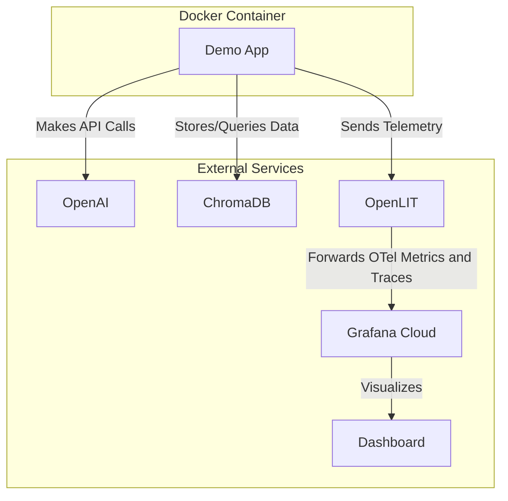

# Docker Deployment Guide

This guide explains how to deploy the AI Observability Demo using Docker Compose.

## Architecture



## Prerequisites

- Docker and Docker Compose installed
- Access to OpenAI API
- Access to Grafana Cloud (for observability)

## Configuration

### 1. Set up Environment Variables

Copy the example environment file and fill in your credentials:

```bash
cp .env.example .env
```

Edit the `.env` file with your actual credentials:
- `OTEL_EXPORTER_OTLP_ENDPOINT`: Your Grafana Cloud OTLP endpoint
- `OTEL_EXPORTER_OTLP_HEADERS`: Your Grafana Cloud OTLP headers
- `OPENAI_API_KEY`: Your OpenAI API key

### 2. Run the Application

Start the application using Docker Compose:

```bash
docker-compose up --build
```

To run in detached mode:
```bash
docker-compose up -d --build
```

To view logs:
```bash
docker-compose logs -f
```

To stop the application:
```bash
docker-compose down
```

## Application Details

The demo application performs the following operations in a loop:

1. Makes an OpenAI API call to GPT-3.5-turbo to generate a short story
2. Makes an OpenAI API call to GPT-4 to get information about Grafana
3. Performs vector database operations using ChromaDB:
   - Adds documents to the collection
   - Queries the collection
   - Deletes documents from the collection

The application runs these operations every hour (3600 seconds) and is instrumented with OpenLIT for observability.

## Monitoring

The application sends telemetry data to Grafana Cloud. You can monitor:
- API call latencies
- Token usage
- Vector database operations
- Error rates
- And more...

## Troubleshooting

To view logs:
```bash
docker-compose logs -f
```

To restart the application:
```bash
docker-compose restart
```

## Security Notes

- Keep your `.env` file secure and never commit it to version control
- Regularly rotate your API keys and secrets
- Use appropriate Docker security practices (non-root user, minimal base image, etc.) 
